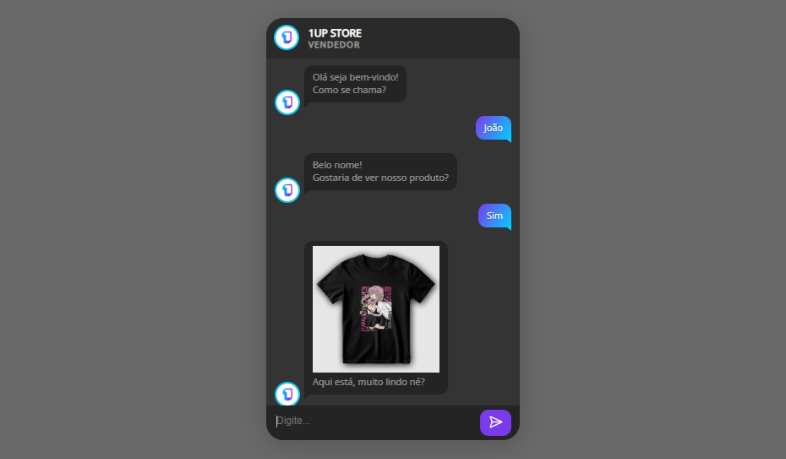

# App Simulador de Chat

## Sobre o projeto

Um apicativo simples que simula uma conversa entre um vendedor e um cliente.

## Como utilizar

Basta digitar qualquer texto no chat para que a conversa se inicie.

## Informações

Projeto desenvolvido utilizando apenas HTML, CSS e JavaScript.

